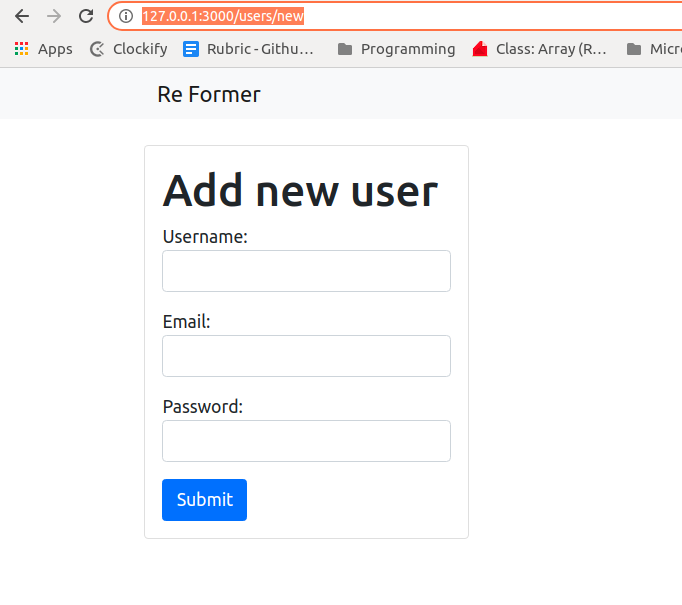

# Re-Former

### Description
This Project was part of the Forms Project in The Odin Project’s Ruby on Rails Curriculum. Find it at http://www.theodinproject.com




## About the Project

<!-- This project is based on the . -->

This project was about creating a simple HTML Form Using Rails. This project was based on The Odin Project’s Ruby on Rails Curriculum. Find it at http://www.theodinproject.com.

**Features**
- Add New User
- Edit User


### Built With

- [Rails](https://guides.rubyonrails.org/)
- [Ruby](https://www.ruby-lang.org/en/)
- HTML
- CSS
- SQLite3
- Bootstrap

## Getting Started

To get a local copy up and running follow these simple example steps.

1. If you're running the Windows Operating System, open your command prompt. On Linux, Open your terminal.

2. Copy and paste the following code into the Terminal:


   ``` git clone https://github.com/cyonii/re-former.git ```

3. Press Enter.

4. Once the repository has been cloned, navigate inside the repository

5. After you will need to update and install some of the depedency. Use following command to install the packages
 - `bundle install`
 - `yarn install`
 - `rake db:migrate`

6. once you install the packages and migrate the database you can run the server
 - `rails s` or `rails server`

7. Enjoy

8. To check the Form on Browser run `http://127.0.0.1:3000/users/new`

9. To Edit the User from Browser run `http://127.0.0.1:3000/users/2/edit` 


## Contributing

Contributions, issues, and feature requests are welcome!
Feel free to check the [issues page](../../issues).

## Show your support

Give a ⭐️ if you like this project!


## Authors


👤 **Divyesh Patel**

- GitHub: [@Div685](https://github.com/Div685)
- Twitter: [@div_685](https://twitter.com/div_685)
- LinkedIn: [Divyesh Patel](https://www.linkedin.com/in/divyesh-daxa-patel)

👤 **Silas Kalu**

- GitHub: [@cyonii](https://github.com/cyonii)
- Twitter: [@theOnuoha](https://twitter.com/theOnuoha)
- LinkedIn: [Silas Kalu](https://www.linkedin.com/in/silas-kalu-2a9a13199/)

## Acknowledgments

- [Ruby-doc](https://ruby-doc.org/core-2.6.5)
- [Rails-doc](https://guides.rubyonrails.org/)